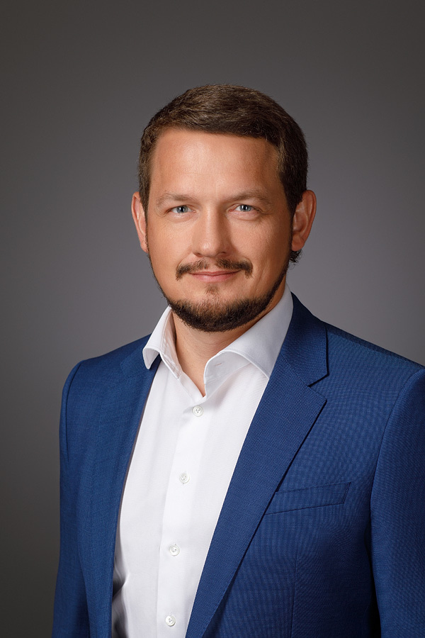

# Сторожев Евгений

## О себе:
* Управлял рестораном на 60 посадочных мест и
увеличил рейтинг отзывов клиентов с 4.2 до 4.7 в
течении 6 месяцев.
* Возглавлял команду из 16 человек и 4 барменов.
сократил текучесть кадров в 2 раза.
* Победитель "Best Regional Restaurant 2019" от журнала
"Лучшие региональные рестораны".

## Ключевые навыки:

1. Проактивность:
Признан "Лучшим продавцом года", после перевыполнения 
установленного плана по регистрации клиентов на карту лояльности;
Был отобран в качестве посла бренда и представлял компанию на отраслевом 
конкурсе Best Contact Center, который проходил по всей стране.

2. Клиентоориентированность:
Прочные навыки решения клиентских проблем с показателем 85% 
решенных запросов с первого звонка;

3. Нацеленность на результат:
Умею ставить цели и выполнять их. Повысил KPI отдела на 20 % 
за последний квартал;
Умею соответствовать ожиданиям и требованиям клиента.
Показатель удовлетворенности клиентов на предыдущей работе — 95%.

